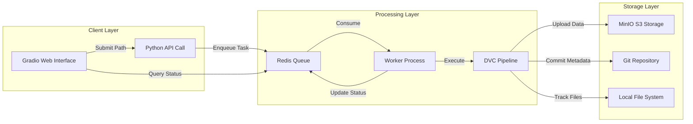
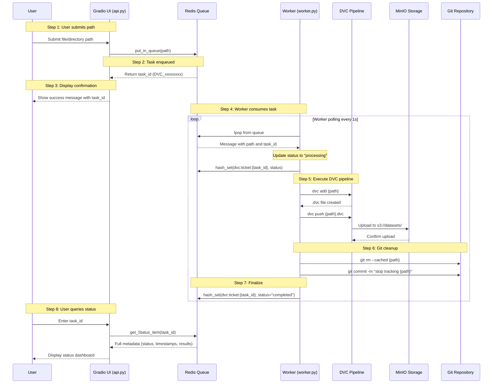
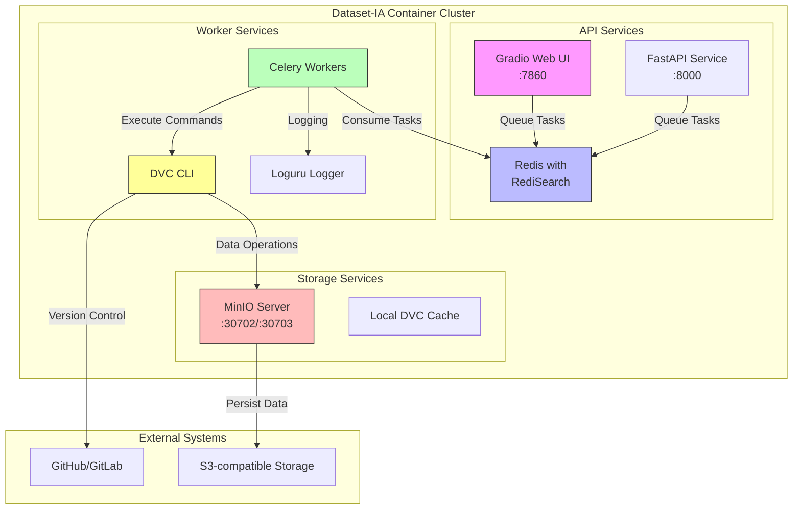

# Dataset-IA: Enterprise Data Versioning & Processing Platform

## Overview

Dataset-IA is a production-grade platform designed for large-scale dataset versioning, management, and automated processing. Built on top of **DVC (Data Version Control)** and integrated with **Redis-powered queue management**, it provides a robust infrastructure for MLOps workflows, enabling teams to version control datasets and models with the same rigor applied to source code.

The platform leverages containerization through Docker and Docker Compose, featuring a distributed worker architecture with real-time status monitoring via a modern Gradio-based web interface.

---

## Key Features

- **Enterprise Data Versioning**: Full DVC integration for reproducible ML pipelines with semantic versioning of datasets and models.
- **Distributed Worker Architecture**: Asynchronous task processing via Redis queue with multi-worker support and automatic failover.
- **Real-time Monitoring**: Gradio-powered web interface providing live queue status, job tracking, and comprehensive metadata visualization.
- **Automated Pipeline**: End-to-end automation including DVC add, push, Git untracking, and CSV inventory generation.
- **Code Quality Assurance**: 
  - Pylint score > 9.5 across all modules
  - Bandit security scanning for vulnerability detection
  - Comprehensive docstring coverage
- **Scalable Storage**: MinIO S3-compatible backend for high-performance object storage.
- **Production-Ready**: Systemd service integration, health checks, and auto-restart policies.

---

## Technical Stack

| Category | Technology |
|----------|------------|
| **Language** | Python 3.10+ |
| **Containerization** | Docker, Docker Compose |
| **Data Versioning** | DVC 3.x |
| **Queue Management** | Redis, wredis |
| **Web Interface** | Gradio |
| **API Framework** | FastAPI |
| **Task Queue** | Celery |
| **Logging** | Loguru |
| **Testing** | Pytest |
| **Security** | Bandit |
| **Code Analysis** | Pylint |
| **Documentation** | Sphinx |
| **Storage** | MinIO (S3-compatible) |
| **CI/CD** | Jenkins |

---

## 1. 🚶 Process Flow Diagram

The following diagram illustrates the high-level flow of the Dataset-IA platform from user interaction to data persistence:



---

## 2. 🗺️ System Workflow (Detailed Sequence)

This sequence diagram shows the complete interaction flow when a user submits a dataset for processing:



---

## 3. 🏗️ Architecture Components

The platform consists of multiple interconnected components organized in layers:



---

## 4. ⚙️ Container Lifecycle

### 4a. Build Process

The following steps are executed when building Docker images:

**Base Image (Dockerfile - DVC Client):**
1. **Base Layer**: `python:3.10.14` - Python runtime environment
2. **System Packages**: Install `gnupg`, `wget`, `git`, `openssh-client`, `graphviz`
3. **DVC Installation**: Add iterative DVC repository and install DVC CLI
4. **ZSH Setup**: Install Oh My Zsh with custom theme and aliases
5. **Python Packages**: Install `pandas`, `sphinx`, `dvc[s3]`, `tqdm`, `glob2`, `boto3`
6. **Git Configuration**: Set global user.email and user.name
7. **MinIO Client**: Download and install `mc` CLI
8. **Custom Aliases**: Add DVC convenience commands to `.zshrc` and `.bashrc`
9. **Project Files**: Copy `.dvc/`, `.git/`, `config/`, `src/` to `/app`
10. **Git Safe Directory**: Configure git safe directory for container execution

**Worker Image (Dockerfile.worker):**
1. **Base Layer**: `wisrovi/agents:gpu-slim-dvc` - Custom base with GPU support
2. **Git Initialization**: Initialize git repo, set remote origin, configure user
3. **DVC Setup**: Copy `.dvc/`, `dvc.lock`, `dvc.yaml`
4. **Cleanup**: Run `dvc remove` and `dvc gc` to clear conflicts
5. **Dependencies**: Install Python packages from `requirements.txt`
6. **Entrypoint**: Set `CMD ["python", "/app/worker.py"]`

### 4b. Runtime Process

When containers start, the following initialization sequence occurs:

**DVC Client Container:**
1. **Entry Point**: Container starts with `tail -f /dev/null` (idle mode)
2. **Environment**: Load `git.env` and `dvc.env` for configuration
3. **Volumes**: Mount `projects/`, `.dvc/`, `.git/` for persistence
4. **Ready State**: Container accepts `docker-compose exec` for interactive use

**Worker Container:**
1. **Entrypoint**: Execute `python /app/worker.py`
2. **Redis Connection**: Connect to Redis at `REDIS_HOST`
3. **Worker Registration**: Call `register_worker_hash()` to announce presence
4. **Queue Subscription**: Call `get_from_queue(worker_function)` to subscribe
5. **Event Loop**: Call `start_receiving()` to begin polling queue
6. **Processing**: On message received, execute DVC pipeline steps:
   - Clean DVC temp files
   - Reproduce pipeline (optional)
   - Verify path exists
   - Add to DVC (`dvc add`)
   - Push to remote (`dvc push`)
   - Git untrack (`git rm --cached`)
   - Git commit
   - Generate inventory CSV

**API Container (Gradio):**
1. **Entrypoint**: Execute `python api.py`
2. **Redis Connection**: Initialize Redis client
3. **Web Server**: Start Gradio on port 7860
4. **Ready State**: UI available at exposed port

### 4c. DVC Cache Optimization

To ensure seamless dataset downloading via external bind mounts (`projects/`), the worker image explicitly enforces **Copy-based Caching**:
- **Bypassing Link Errors**: DVC defaults to symlinks/hardlinks, which often fail across Docker's internal OverlayFS and host-mounted volumes.
- **Enforced Copy Mode**: `dvc config cache.type copy` is executed during the image build, forcing real file copies to the `projects/` volume, preventing 0-byte or corrupt downloads during `dvc pull`.
- **Pre-baked State**: The image bakes the `.dvc/` directory and lock files without executing destructive cleanup (`dvc gc`), ensuring a healthy state prior to runtime.

---

## 5. 📂 File-by-File Guide

| File/Directory | Description |
|---------------|-------------|
| **api.py** | Gradio web interface entry point; provides UI for queue submission and status monitoring |
| **worker.py** | Main worker process; consumes Redis queue messages and executes DVC pipeline |
| **worker_queue.py** | Redis queue management module; provides `put_in_queue()`, `get_Status_item()`, and decorators |
| **Makefile** | Build automation commands for server, worker, API, and documentation management |
| **Dockerfile** | Base DVC client image definition with Python 3.10, DVC, ZSH, and MinIO client |
| **Dockerfile.worker** | Worker container image; builds from GPU-enabled base with DVC and queue client |
| **Dockerfile.api** | Gradio API container image; serves web UI for queue operations |
| **docker-compose.yml** | Main orchestration; defines DVC client, MinIO server, and documentation services |
| **docker-compose.worker.yaml** | Worker orchestration; defines worker, Redis, and API services |
| **docker-compose.api.yaml** | API services; Redis with RediSearch, Redis Commander, and Gradio API |
| **requirements.txt** | Python dependencies including DVC, Gradio, Redis clients, Loguru, and testing tools |
| **config/git/git.env** | Git user configuration (email, username) |
| **config/dvc/dvc.env** | DVC remote credentials (URL, access key, secret key) |
| **.dvc/config** | DVC configuration with MinIO remote settings and timeouts |
| **src/scripts/api/app/worker_queue.py** | Redis queue abstraction using wredis; manages task lifecycle |
| **src/scripts/upload/files_inventory.py** | Generates CSV inventory of uploaded datasets with checksums |
| **src/scripts/upload/dvc_up.sh** | Shell script for automated DVC upload workflow |
| **src/scripts/download/download_some_file.py** | Python script for selective file downloads |
| **src/scripts/download/download_complete_folder.sh** | Shell script for folder downloads |
| **src/scripts/data/xml_2_txt.py** | Data transformation utility for XML to text conversion |
| **production/os/datasetIA_worker@.service** | Systemd service file for worker deployment |
| **production/os/datasetIA_worker@.timer** | Systemd timer for scheduled worker execution |
| **jenkins/build/*.jenkinsfile** | Jenkins CI pipelines for build stages |
| **jenkins/deploy/*.jenkinsfile** | Jenkins CD pipelines for deployment stages |

---

## Installation & Setup

### Prerequisites

- Docker Engine 20.10+
- Docker Compose 1.29+
- Python 3.10+ (for local development)
- Git

### Quick Start

```bash
# Clone the repository
git clone git@github.com:cimacorporate/dataset-IA.git
cd dataset-IA

# Create and activate virtual environment
python -m venv venv
source venv/bin/activate  # Linux/macOS
# or
venv\Scripts\activate     # Windows

# Install dependencies
make install

# Start MinIO storage server
make server_start

# Start client environment (DVC + documentation)
make client_start
```

### Environment Configuration

Create configuration files in `config/`:

```bash
# config/git/git.env
EMAIL=your.email@company.com
USER=your_username

# config/dvc/dvc.env
DVC_URL=http://<minio-ip>:<port>
DVC_USER=<access-key>
DVC_PASSWORD=<secret-key>
```

---

## Architecture & Workflow

### File Tree

```
dataset-IA/
├── .dvc/                          # DVC configuration and cache
│   └── config                     # DVC remote settings
├── .gitignore                     # Git ignore patterns
├── .dvcignore                     # DVC ignore patterns
├── api.py                         # Gradio web interface entry point
├── worker.py                      # Worker process entry point
├── worker_queue.py                # Redis queue management module
├── Makefile                       # Build and deployment commands
├── Dockerfile                     # Base DVC image definition
├── Dockerfile.worker              # Worker container image
├── Dockerfile.api                 # API container image
├── Dockerfile.docs                # Documentation container
├── docker-compose.yml             # Main orchestration (DVC client, MinIO, docs)
├── docker-compose.worker.yaml    # Worker services (worker, Redis)
├── dvc.lock                       # DVC lock file
├── dvc.yaml                       # DVC pipeline definition
├── requirements.txt               # Python dependencies
├── config/                        # Environment configurations
│   ├── git/git.env                # Git user configuration
│   ├── dvc/dvc.env                # DVC remote credentials
│   └── ssh/                       # SSH keys for remote access
├── src/
│   └── scripts/
│       ├── api/
│       │   └── app/
│       │       ├── worker_queue.py    # Queue management (Redis)
│       │       └── __init__.py
│       ├── download/
│       │   └── download_some_file.py
│       ├── upload/
│       │   ├── files_inventory.py     # CSV inventory generator
│       │   └── dvc_up.sh
│       └── data/
│           ├── xml_2_txt.py
│           └── classes.yml
├── projects/                      # Individual ML projects
│   └── AREPO/
│       └── Atributos.csv
├── docs/                          # Sphinx documentation sources
├── jenkins/                       # CI/CD pipelines
│   ├── build/                     # Build pipelines
│   └── deploy/                    # Deployment pipelines
├── production/                    # Production configurations
│   ├── os/                        # Systemd service files
│   ├── docker/                    # Production Docker configs
│   └── install.sh
└── notebooks/                     # Jupyter notebooks
```

---

## Configuration

### Environment Variables

| Variable | Description | Default |
|----------|-------------|---------|
| `USER` | Git username | - |
| `EMAIL` | Git email | - |
| `DVC_URL` | MinIO endpoint URL | - |
| `DVC_USER` | MinIO access key | - |
| `DVC_PASSWORD` | MinIO secret key | - |
| `REDIS_HOST` | Redis server hostname | `redis` |
| `IP_HOST` | Worker IP address | Environment detection |

### DVC Configuration

The `.dvc/config` file contains optimized settings:

```ini
[core]
    autostage = true
    remote = minio

[cache]
    type = symlink, copy

['remote "minio"']
    url = s3://datasets
    jobs = 8
    read_timeout = 300
    connect_timeout = 60
```

---

## Usage

### Makefile Commands

```bash
# Server Management
make server_start              # Start MinIO storage server

# Client Environment
make client_start               # Start DVC client container
make client_into                # Enter DVC container shell
make client_stop                # Stop client services

# Worker Management
make start_worker               # Start background worker
make stop_worker               # Stop worker
make logs_worker               # View worker logs
make into_worker               # Enter worker container

# API Management
make start_api                  # Start Gradio API + Redis
make stop_api                  # Stop API services

# Documentation
make docs_build                # Build Sphinx documentation
make docs_serve                # Serve docs locally on port 1200
make docs_container_build      # Build docs Docker image
make docs_container_up         # Serve docs via container
```

### Python API Usage

```python
from src.scripts.api.app.worker_queue import put_in_queue, get_Status_item

# Add item to processing queue
result = put_in_queue("/app/projects/dataset/raw")
task_id = result["id"]

# Check status
status = get_Status_item(task_id)
print(status["metadata"]["status"])  # pending → processing → completed
```

### Data Operations

```bash
# Upload dataset to DVC
dvc add /app/projects/data/raw
dvc push

# Download dataset from DVC
dvc pull

# Create inventory CSV
python src/scripts/upload/files_inventory.py /app/projects/data/raw
```

---

## Security

- **Credential Management**: Sensitive credentials stored in environment files, never committed to version control.
- **Network Isolation**: Docker networks isolate components.
- **MinIO Access Control**: Dedicated access keys with minimal permissions.
- **SSH Key Management**: Separate keys for Git and deployment operations.
- **Bandit Scanning**: Regular security audits to detect common vulnerabilities.

---

## Documentation

Comprehensive documentation is available in the `docs/` directory, built with Sphinx:

- **Quick Start**: Getting started guide
- **API Reference**: Detailed API documentation
- **Configuration Guide**: Environment and service configuration
- **Troubleshooting**: Common issues and solutions
- **Best Practices**: Production deployment recommendations

Build and serve documentation locally:

```bash
make docs_build
make docs_serve
```

---

## Contributing

1. Fork the repository
2. Create a feature branch: `git checkout -b feature/your-feature`
3. Ensure code quality: `pylint src/` and `bandit -r src/`
4. Run tests: `pytest tests/`
5. Commit changes with descriptive messages
6. Push to your fork and create a Pull Request

---

## Support

For issues, questions, or contributions, please open an issue on the GitHub repository or contact the maintainers.

---

## Author

**William Rodríguez** - *Technology Evangelist & Principal Architect*  
LinkedIn: [https://linkedin.com/in/wisrovi](https://linkedin.com/in/wisrovi)  
GitHub: [https://github.com/wisrovi](https://github.com/wisrovi)

---

## License

Proprietary - All rights reserved.
