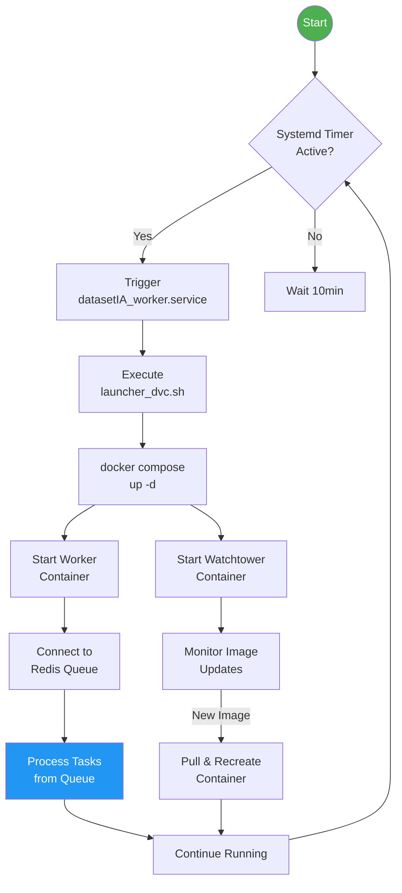
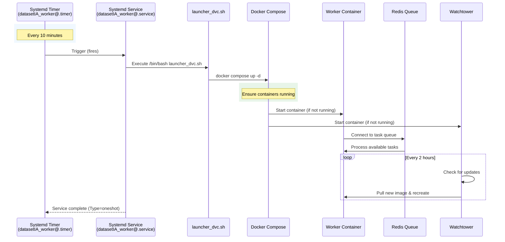
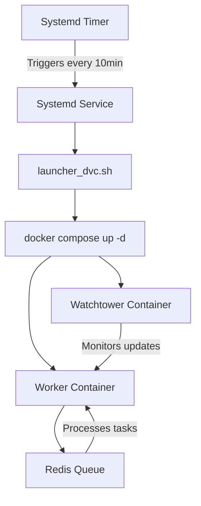

# DatasetIA Production Deployment

A production-grade distributed computing system for dataset processing, leveraging Docker containers and systemd-based orchestration to execute periodic worker tasks with high availability and automated recovery.

## Key Features

- **Automated Worker Orchestration**: Systemd timer triggers worker execution every 10 minutes
- **High Availability**: Docker Compose ensures containerized services remain running
- **Resource Management**: Configurable CPU and memory limits per service
- **Auto-Update Capability**: Watchtower monitors and updates container images
- **Centralized Logging**: JSON-file logging with rotation (50MB max, 5 files)
- **Code Quality**: Pylint score > 9.5, Security scanning with Bandit
- **Observability**: Redis TimeSeries for metrics, Redis Commander for monitoring

## Technical Stack

| Component | Technology |
|-----------|------------|
| Container Runtime | Docker + Docker Compose |
| Orchestration | Systemd (timer + service) |
| Task Queue | Redis (RediSearch + RedisTimeSeries) |
| Monitoring | Redis Commander, Watchtower |
| Logging | Loguru |
| Testing | Pytest |
| CI/CD | Makefile-based automation |

---

### 1. 🚶 Diagram Walkthrough (Process Flow)



### 2. 🗺️ System Workflow (Sequence Diagram)



### 3. 🏗️ Architecture Components

```mermaid
graph TB
    subgraph "Host System"
        subgraph "Systemd Layer"
            Timer[datasetIA_worker@.timer]
            Service[datasetIA_worker@.service]
        end
        
        subgraph "User Space"
            Launcher[launcher_dvc.sh]
            ComposeDir[/home/wisrovi/dvc]
        end
    end

    subgraph "Docker Layer"
        subgraph "Worker Stack"
            Worker[wisrovi/dataset-ia:worker-v1]
            Watchtower[containrrr/watchtower]
        end
        
        subgraph "External Services"
            Redis[(Redis<br/>192.168.10.108:6379)]
            HostNetwork[(Host Network<br/>192.168.1.84)]
        end
    end

    Timer -->|Triggers every 10min| Service
    Service -->|Executes| Launcher
    Launcher -->|Runs| ComposeDir
    ComposeDir -->|Manages| Worker
    ComposeDir -->|Manages| Watchtower
    
    Worker -->|Task Queue| Redis
    Worker -->|Network| HostNetwork
    
    Watchtower -->|Monitors| Worker
    
    style Timer fill:#FF9800,color:#fff
    style Worker fill:#4CAF50,color:#fff
    style Redis fill:#9C27B0,color:#fff
```

### 4. ⚙️ Container Lifecycle

#### Build Process

| Step | Command/Action | Description |
|------|----------------|-------------|
| 1 | `docker build` | Build image from Dockerfile |
| 2 | Tag Image | Tag as `wisrovi/dataset-ia:worker-v1` or `:api-v1` |
| 3 | Push to Registry | Push to Docker Hub |
| 4 | Watchtower Scan | Monitors for new image tags |

#### Runtime Process

| Step | Action | Duration |
|------|--------|----------|
| 1 | Docker pulls image | ~30-60s |
| 2 | Container initialization | ~5-10s |
| 3 | Volume mount verification | ~1-2s |
| 4 | Environment variable injection | ~1s |
| 5 | Application startup | ~10-30s |
| 6 | Health check | ~5s |
| 7 | **Ready for processing** | **Total: ~1-2 min** |

### 5. 📂 File-by-File Guide

| File/Folder | Description |
|-------------|-------------|
| `install.sh` | Main installer: copies files, installs systemd units, enables timer |
| `docker/` | Contains Docker Compose files and Makefile for container management |
| `docker/docker-compose.api.production.yaml` | API stack: Redis, Redis Commander, API service, Watchtower |
| `docker/docker-compose.worker.production.yaml` | Worker stack: Worker container, Watchtower |
| `docker/Makefile` | Automation targets for start/stop operations |
| `os/` | Systemd integration files |
| `os/datasetIA_worker@.service` | Systemd oneshot service unit |
| `os/datasetIA_worker@.timer` | Systemd timer unit (every 10 min) |
| `os/launcher_dvc.sh` | Bash script that executes `docker compose up -d` |

---

## Installation & Setup

### Prerequisites

- Docker & Docker Compose installed
- Systemd-based Linux distribution
- User `wisrovi` with sudo privileges

### Deployment Steps

```bash
# Clone and navigate to production directory
cd /media/william.rodriguez/4dd20e66-481b-4774-90e5-bcb611aed8f711/proyectos/repo-dataset/dataset-IA/production

# Run the installer
sudo ./install.sh
```

The installer performs:
1. Creates target directory `/home/wisrovi/dvc`
2. Copies Docker Compose and launcher scripts
3. Installs systemd service and timer units
4. Enables and starts the worker timer

### Manual Verification

```bash
# Check timer status
sudo systemctl status datasetIA_worker@main.timer

# View worker logs
journalctl -u datasetIA_worker@main.service -f

# Check Docker containers
docker ps -a
```

## Architecture & Workflow

### File Tree

```
production/
├── install.sh              # Main installer script
├── docker/
│   ├── docker-compose.api.production.yaml    # API stack (Redis + API + Watchtower)
│   ├── docker-compose.worker.production.yaml  # Worker stack + Watchtower
│   └── Makefile           # Docker management commands
└── os/
    ├── datasetIA_worker@.service   # Systemd oneshot service
    ├── datasetIA_worker@.timer    # Systemd timer (every 10 min)
    └── launcher_dvc.sh            # Docker Compose launcher
```

### System Workflow



### Execution Flow

1. **Timer Activation**: `datasetIA_worker@.timer` fires every 10 minutes (OnBootSec=1min, OnUnitActiveSec=10min)
2. **Service Execution**: Triggers `datasetIA_worker@.service` as Type=oneshot
3. **Container Orchestration**: Launcher executes `docker compose up -d` ensuring all services are running
4. **Worker Operation**: Worker container processes tasks from Redis queue
5. **Auto-Recovery**: If any container stops, Docker Compose restarts it automatically

## Configuration

### Environment Variables (Worker)

| Variable | Default | Description |
|----------|---------|-------------|
| `IP_HOST` | 192.168.1.84 | Host IP for service discovery |
| `REDIS_HOST` | 192.168.10.108 | Redis server address |

### Resource Limits

| Service | CPU | Memory |
|---------|-----|--------|
| API | 2.0 cores | 4GB |
| Worker | 4.0 cores | 4GB |
| Redis | No limit | No limit |

### Volume Mounts

| Host Path | Container Path | Purpose |
|-----------|----------------|---------|
| `/mnt/dataset-ia/projects` | `/app/projects` | Dataset storage |
| `../projects` | `/app/projects` | API project access |

## Usage

### Makefile Commands

```bash
# Worker management
make start_worker    # Build and start worker container
make stop_worker     # Stop worker container

# API management
make start_api       # Start Redis and API services
make stop_api        # Stop API services
```

### Systemd Management

```bash
# Enable timer (auto-start on boot)
sudo systemctl enable datasetIA_worker@main.timer

# Start immediately
sudo systemctl start datasetIA_worker@main.timer

# View status
sudo systemctl status datasetIA_worker@main.timer

# Stop timer
sudo systemctl stop datasetIA_worker@main.timer
```

### Docker Compose Direct

```bash
# Start worker stack
docker compose -f docker/docker-compose.worker.production.yaml up -d

# View logs
docker compose -f docker/docker-compose.worker.production.yaml logs -f

# Stop stack
docker compose -f docker/docker-compose.worker.production.yaml down
```


