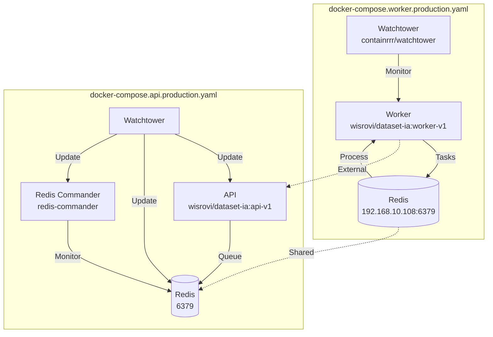
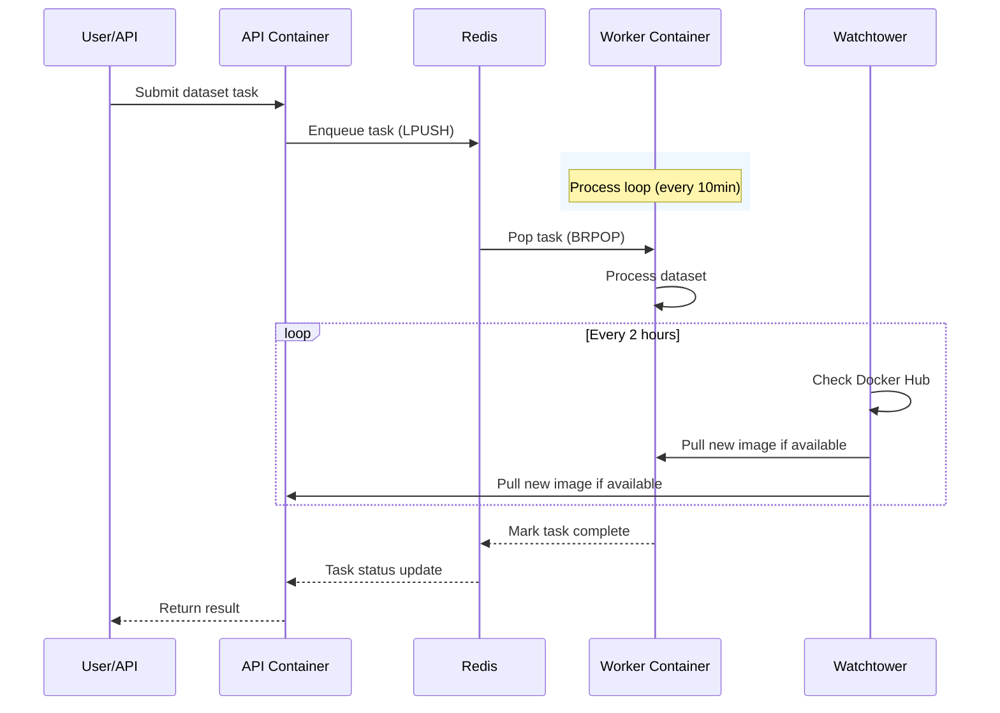
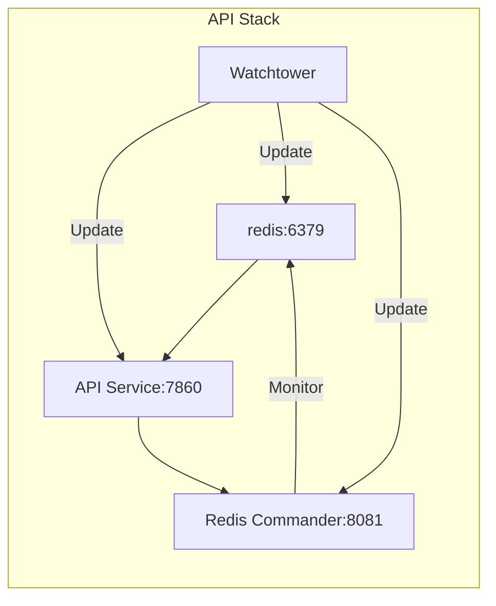
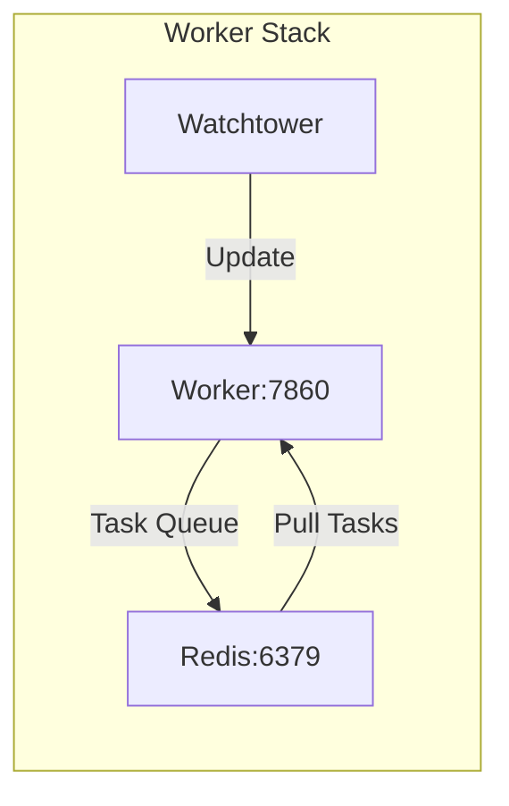

# DatasetIA Docker Stack

Production-grade Docker Compose configurations for DatasetIA services, featuring containerized API, Worker, and monitoring components with automated updates and resource management.

## Key Features

- **Multi-Service Orchestration**: Redis, Redis Commander, API, Worker, and Watchtower
- **Resource Isolation**: Configurable CPU and memory limits per container
- **Auto-Update Monitoring**: Watchtower automatically pulls and updates container images
- **Persistent Logging**: JSON-file logging with 50MB rotation and 5-file retention
- **Shared Memory Optimization**: Worker allocated 16GB shared memory for large dataset processing
- **Health Monitoring**: Redis Commander web UI for queue inspection

---

### 1. 🚶 Diagram Walkthrough (Process Flow)



### 2. 🗺️ System Workflow (Sequence Diagram)



### 3. 🏗️ Architecture Components

```mermaid
graph TB
    subgraph "API Stack (docker-compose.api.production.yaml)"
        API[API Service<br/>:4467<br/>wisrovi/dataset-ia:api-v1]
        Redis[Redis<br/>:6379<br/>redislabs/redismod]
        RC[Redis Commander<br/>:4468<br/>redis-commander]
        Wt1[Watchtower<br/>containrrr/watchtower]
    end

    subgraph "Worker Stack (docker-compose.worker.production.yaml)"
        Worker[Worker<br/>wisrovi/dataset-ia:worker-v1]
        Wt2[Watchtower<br/>containrrr/watchtower]
    end

    subgraph "External"
        Projects[/mnt/dataset-ia/projects]
        HostNet[Host Network<br/>192.168.1.84]
        RedisExt[(Redis Remote<br/>192.168.10.108:6379)]
    end

    API --> Redis
    API --> Projects
    Worker --> RedisExt
    Worker --> Projects
    RC --> Redis
    
    Wt1 -->|Update images| API
    Wt1 -->|Update images| Redis
    Wt1 -->|Update images| RC
    Wt2 -->|Update images| Worker
    
    API -->|Network| HostNet

    style API fill:#2196F3,color:#fff
    style Worker fill:#4CAF50,color:#fff
    style Redis fill:#9C27B0,color:#fff
```

### 4. ⚙️ Container Lifecycle

#### Build Process

| Step | Command/Action | Description |
|------|----------------|-------------|
| 1 | `docker build -t wisrovi/dataset-ia:api-v1 .` | Build API image from Dockerfile |
| 2 | `docker build -t wisrovi/dataset-ia:worker-v1 .` | Build Worker image from Dockerfile |
| 3 | `docker push wisrovi/dataset-ia:api-v1` | Push to registry |
| 4 | `docker push wisrovi/dataset-ia:worker-v1` | Push to registry |

#### Runtime Process

| Service | Step | Duration |
|---------|------|----------|
| **Worker** | 1. Pull image (if needed) | ~30s |
| | 2. Create container | ~2s |
| | 3. Mount volumes | ~1s |
| | 4. Apply resource limits | ~1s |
| | 5. Start process | ~5s |
| | **Ready** | **~40s** |
| **API** | 1. Pull image (if needed) | ~30s |
| | 2. Create container | ~2s |
| | 3. Start API server | ~10s |
| | **Ready** | **~45s** |
| **Redis** | 1. Start Redis server | ~3s |
| | 2. Load modules | ~2s |
| | **Ready** | **~5s** |

### 5. 📂 File-by-File Guide

| File | Description |
|------|-------------|
| `docker-compose.api.production.yaml` | Defines API stack: Redis, Redis Commander, API service, Watchtower |
| `docker-compose.worker.production.yaml` | Defines Worker stack: Worker container with Watchtower |
| `Makefile` | Automation targets for `start_worker`, `stop_worker`, `start_api`, `stop_api` |

---

## Services Architecture

### API Stack (`docker-compose.api.production.yaml`)



| Service | Image | Port | Resources |
|---------|-------|------|-----------|
| Redis | redislabs/redismod | 6379 | Unlimited |
| Redis Commander | rediscommander/redis-commander | 4468 | Default |
| API | wisrovi/dataset-ia:api-v1 | 4467 | 2 CPU, 4GB |
| Watchtower | containrrr/watchtower | - | Default |

### Worker Stack (`docker-compose.worker.production.yaml`)



| Service | Image | Resources |
|---------|-------|-----------|
| Worker | wisrovi/dataset-ia:worker-v1 | 4 CPU, 4GB, 16GB SHM |
| Watchtower | containrrr/watchtower | Default |

## Configuration

### Watchtower Schedule

Both stacks use Watchtower with the same schedule:

```bash
0 0 0,2,4,6,8,10,12,14,16,18,20,22 * * *
```

This runs every 2 hours (at minutes 0, 2, 4... 22 of every hour).

### Environment Variables

**Worker Service:**
```yaml
environment:
  - IP_HOST=192.168.1.84
  - REDIS_HOST=192.168.10.108
```

**Redis Commander:**
```yaml
environment:
  - REDIS_HOSTS=local:redis:6379
  - HTTP_USER=root
  - HTTP_PASSWORD=qwerty
```

### Volume Mounts

```yaml
# API Stack
volumes:
  - ../projects:/app/projects    # Host:Container

# Worker Stack
volumes:
  - /mnt/dataset-ia/projects:/app/projects
```

## Usage

### Using Makefile

```bash
# Start worker only
make start_worker

# Stop worker
make stop_worker

# Start API stack (API + Redis)
make start_api

# Stop API stack
make stop_api
```

### Using Docker Compose Directly

```bash
# Start worker stack
docker compose -f docker-compose.worker.production.yaml up -d

# Start API stack
docker compose -f docker-compose.api.production.yaml up -d

# View logs
docker compose logs -f worker
docker compose logs -f api
docker compose logs -f redis

# Rebuild and recreate
docker compose up -d --build --force-recreate

# Pull latest images
docker compose pull
```

### Service Management

```bash
# List running containers
docker ps

# Inspect container
docker inspect <container_name>

# View resource usage
docker stats

# Access container shell
docker exec -it <container_name> /bin/bash
```

## File Reference

```
docker/
├── docker-compose.api.production.yaml    # API + Redis + Watchtower
├── docker-compose.worker.production.yaml # Worker + Watchtower
└── Makefile                               # Automation targets
```

## Security Considerations

- **Network Isolation**: Services communicate over Docker internal network
- **Credential Management**: Redis Commander uses HTTP authentication
- **Watchtower Control**: Selective enable/disable via labels
- **Resource Limits**: Prevents container resource exhaustion


