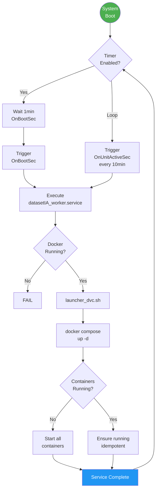
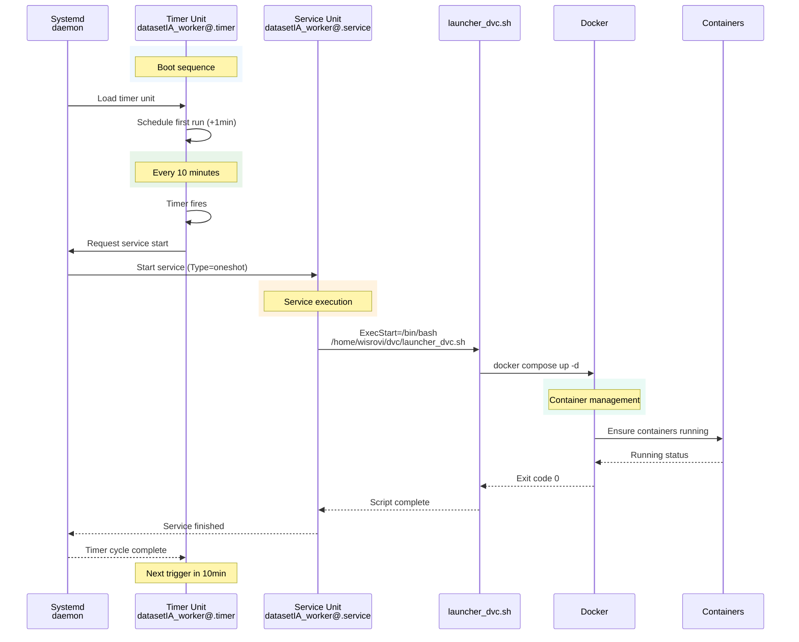

# DatasetIA OS Integration

Systemd-based service orchestration for automated worker execution on Linux systems. Implements a timer-triggered watchdog pattern ensuring the DatasetIA worker stack remains running continuously.

## Key Features

- **Periodic Execution**: Timer triggers worker every 10 minutes
- **Watchdog Pattern**: Ensures Docker Compose stack is always running
- **Boot Safety**: Initial delay of 1 minute before first execution
- **User Isolation**: Runs under `wisrovi` user context
- **Dependency Management**: Requires Docker service to be active
- **Idempotent Operation**: Safe to run multiple times (docker compose up -d)

---

### 1. 🚶 Diagram Walkthrough (Process Flow)



### 2. 🗺️ System Workflow (Sequence Diagram)



### 3. 🏗️ Architecture Components

```mermaid
graph TB
    subgraph "Systemd Layer"
        Timer[datasetIA_worker@.timer<br/>Timer Unit]
        Service[datasetIA_worker@.service<br/>Service Unit]
    end

    subgraph "User Space"
        Launcher[launcher_dvc.sh<br/>Bash Script]
        DvcDir[/home/wisrovi/dvc<br/>Working Directory]
    end

    subgraph "Docker Engine"
        Compose[Docker Compose<br/>Manager]
    end

    subgraph "Containers"
        Worker[Worker<br/>Container]
        Watchtower[Watchtower<br/>Container]
    end

    subgraph "External"
        DockerHub[(Docker Hub<br/>Image Registry)]
    end

    Timer -->|Triggers| Service
    Service -->|Executes| Launcher
    Launcher -->|Changes to| DvcDir
    Launcher -->|Runs| Compose
    
    Compose -->|Manages| Worker
    Compose -->|Manages| Watchtower
    
    Watchtower -->|Pulls from| DockerHub
    Worker -->|Pulls from| DockerHub

    style Timer fill:#FF9800,color:#fff
    style Service fill:#FF9800,color:#fff
    style Worker fill:#4CAF50,color:#fff
```

### 4. ⚙️ Container Lifecycle

#### Build Process

The systemd units are template units (with `@`), meaning they support instantiation:

| Step | Command | Description |
|------|---------|-------------|
| 1 | `sudo cp os/datasetIA_worker@.service /etc/systemd/system/` | Copy service template |
| 2 | `sudo cp os/datasetIA_worker@.timer /etc/systemd/system/` | Copy timer template |
| 3 | `sudo systemctl daemon-reload` | Reload systemd configuration |
| 4 | `sudo systemctl enable datasetIA_worker@main.timer` | Enable timer with instance "main" |

#### Runtime Process

| Phase | Action | Duration |
|-------|--------|----------|
| **1** | Timer triggers at scheduled interval | ~0s |
| **2** | Systemd queues service start | ~1s |
| **3** | Check Docker service dependency | ~1s |
| **4** | Execute launcher script | ~5-15s |
| **5** | Docker Compose parses YAML | ~2s |
| **6** | Pull images (if needed) | ~30-120s |
| **7** | Create/start containers | ~10s |
| **8** | Service reports completion | ~1s |
| **Total** | | **~50s - 2.5min** |

### 5. 📂 File-by-File Guide

| File | Description |
|------|-------------|
| `datasetIA_worker@.service` | Systemd oneshot service unit template with Docker dependency |
| `datasetIA_worker@.timer` | Systemd timer unit with 10-minute interval configuration |
| `launcher_dvc.sh` | Bash script that executes `docker compose up -d` in target directory |

---

## Architecture

### Component Interaction

```mermaid
flowchart TD
    A[Systemd Timer] -->|OnBootSec=1min| B[Initial Boot]
    A -->|OnUnitActiveSec=10min| C[Periodic Trigger]
    B --> D[datasetIA_worker@main.service]
    C --> D
    D --> E[launcher_dvc.sh]
    E --> F[docker compose up -d]
    F --> G[Worker Container]
    F --> H[Watchtower Container]
    G --> I[Redis Queue]
```

### Service Unit (`datasetIA_worker@.service`)

```ini
[Unit]
Description=DatasetIA Worker Watchdog (%I)
After=docker.service
Requires=docker.service

[Service]
Type=oneshot
RemainAfterExit=yes
WorkingDirectory=/home/wisrovi/dvc
ExecStart=/bin/bash /home/wisrovi/dvc/launcher_dvc.sh

[Install]
WantedBy=multi-user.target
```

**Key Properties:**
- `Type=oneshot`: Executes once and exits
- `RemainAfterExit=yes`: Reports as "active" after completion
- `After=docker.service`: Ensures Docker is ready
- `Requires=docker.service`: Fails if Docker unavailable

### Timer Unit (`datasetIA_worker@.timer`)

```ini
[Unit]
Description=Run DatasetIA Worker Watchdog every 10 minutes

[Timer]
OnBootSec=1min
OnUnitActiveSec=10min
Unit=datasetIA_worker@%i.service

[Install]
WantedBy=timers.target
```

**Timing Configuration:**
- `OnBootSec=1min`: First execution 1 minute after boot
- `OnUnitActiveSec=10min`: Subsequent executions every 10 minutes

### Launcher Script (`launcher_dvc.sh`)

```bash
#!/bin/bash
COMPOSE_DIR="/home/wisrovi/dvc"

if cd "$COMPOSE_DIR"; then
    /usr/bin/docker compose up -d
else
    echo "[$(date)] ERROR: No se pudo acceder a $COMPOSE_DIR"
    exit 1
fi
```

## Installation

The installer (`install.sh`) performs:

```bash
# Create target directory
sudo mkdir -p /home/wisrovi/dvc

# Copy deployment files
sudo cp docker/docker-compose.worker.production.yaml /home/wisrovi/dvc/docker-compose.yml
sudo cp os/launcher_dvc.sh /home/wisrovi/dvc/
sudo chmod +x /home/wisrovi/dvc/launcher_dvc.sh

# Install systemd units
sudo cp os/datasetIA_worker@.service /etc/systemd/system/
sudo cp os/datasetIA_worker@.timer /etc/systemd/system/

# Set ownership
sudo chown -R wisrovi:wisrovi /home/wisrovi/dvc

# Enable timer
sudo systemctl daemon-reload
sudo systemctl enable --now datasetIA_worker@main.timer
```

## Usage

### Timer Management

```bash
# Enable (auto-start on boot)
sudo systemctl enable datasetIA_worker@main.timer

# Start immediately
sudo systemctl start datasetIA_worker@main.timer

# Stop
sudo systemctl stop datasetIA_worker@main.timer

# Disable
sudo systemctl disable datasetIA_worker@main.timer

# View status
sudo systemctl status datasetIA_worker@main.timer

# List all timers
systemctl list-timers --all
```

### Service Management

```bash
# Manual trigger
sudo systemctl start datasetIA_worker@main.service

# View service status
sudo systemctl status datasetIA_worker@main.service

# View logs
journalctl -u datasetIA_worker@main.service
journalctl -u datasetIA_worker@main.service -f

# View recent executions
journalctl --since "1 hour ago" -u datasetIA_worker@main.service
```

### Instance Management

The `@` syntax allows multiple instances:

```bash
# Create instance 'test'
sudo cp /etc/systemd/system/datasetIA_worker@{main,test}.service
sudo cp /etc/systemd/system/datasetIA_worker@{main,test}.timer

# Start test instance
sudo systemctl start datasetIA_worker@test.timer
```

## File Reference

```
os/
├── datasetIA_worker@.service    # Systemd oneshot service template
├── datasetIA_worker@.timer      # Systemd timer unit template
└── launcher_dvc.sh             # Docker Compose launcher script
```

## Troubleshooting

### Timer Not Firing

```bash
# Check timer status
sudo systemctl status datasetIA_worker@main.timer

# List timers
systemctl list-timers

# View timer logs
journalctl -u datasetIA_worker@main.timer -f
```

### Service Failing

```bash
# Check service logs
journalctl -u datasetIA_worker@main.service -xe

# Verify Docker is running
sudo systemctl status docker

# Verify directory exists
ls -la /home/wisrovi/dvc
```

### Docker Compose Issues

```bash
# Manual execution test
cd /home/wisrovi/dvc
docker compose up -d

# View container status
docker ps -a

# View compose logs
docker compose logs
```


